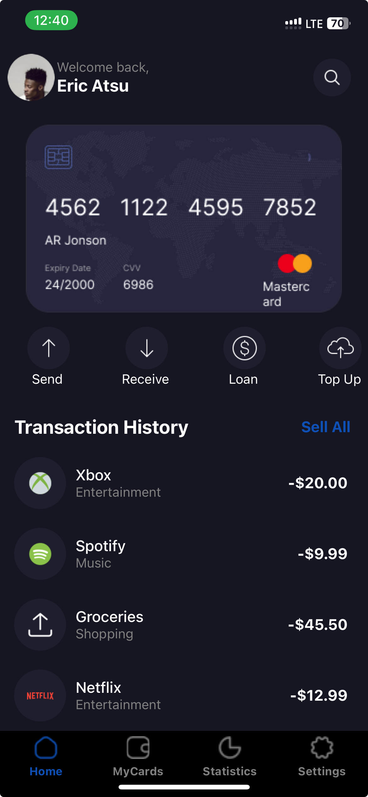
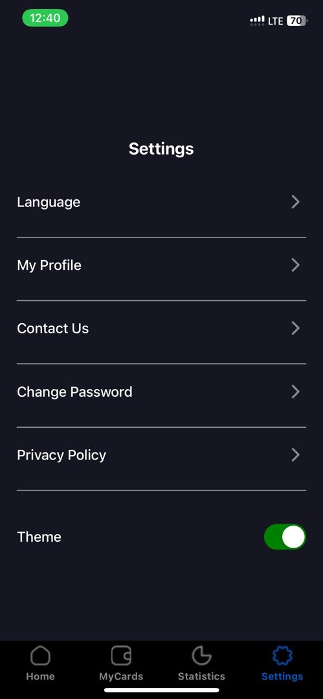
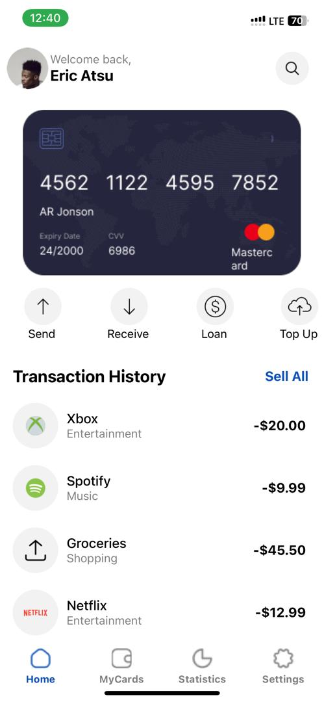
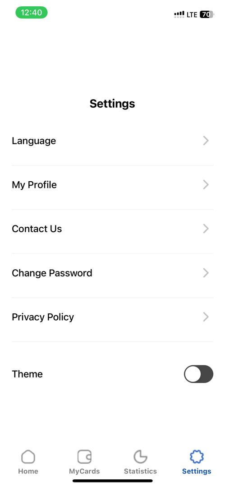

# rn-assignment5-11181591
Here's a README file that covers the instructions provided:

---

# React Native Assignment 5 - Mobile Application Development

This repository contains the implementation of the design specified in the UI mockup for Assignment 5 of the DCIT202 Mobile Application Development course. The app includes bottom tab navigation with Home, MyCards, Statistics, and Settings screens, and features a light/dark theme switch.

## Table of Contents
- [Description](#description)
- [Screenshots](#screenshots)
- [Setup and Installation](#setup-and-installation)
- [Usage](#usage)
- [Commit History](#commit-history)
- [Submission](#submission)

## Description
This application was built using React Native and includes the following features:
- Bottom tab navigation with four screens: Home, MyCards, Statistics, and Settings.
- Light and dark theme switching capability.
- Custom components and styles to closely match the provided UI design.

### Features
1. **Bottom Tab Navigation**: Uses `@react-navigation/bottom-tabs` to create a tab navigator.
2. **Theme Switching**: Allows users to switch between light and dark themes using a context-based approach.
3. **Custom Components and Styling**: Each screen is styled to match the provided UI mockup, with custom components used throughout the application.

## Screenshots





## Setup and Installation
To set up and run this project locally, follow these steps:

1. Clone the repository to your local machine:
    ```bash
    git clone https://github.com/yourusername/rn-assignment5-ID.git
    cd rn-assignment5-ID
    ```

2. Install the necessary dependencies:
    ```bash
    npm install
    ```

3. Run the application:
    ```bash
    npm start
    ```

## Usage
- **Navigation**: Use the bottom tab navigator to switch between Home, MyCards, Statistics, and Settings screens.
- **Theme Switching**: Go to the Settings screen and use the toggle switch to change between light and dark themes.

### Screens Description:
1. **Home Screen**: Displays a welcome message and is styled according to the current theme.
2. **MyCards Screen**: Displays placeholder text, styled based on the current theme.
3. **Statistics Screen**: Displays placeholder text, styled based on the current theme.
4. **Settings Screen**: Allows users to switch between light and dark themes and contains other placeholder settings.

## Commit History
- **Initial Commit**: Set up the project structure and installed necessary dependencies.
- **Bottom Tab Navigation**: Added bottom tab navigation with Home, MyCards, Statistics, and Settings screens.
- **Theme Context Setup**: Implemented ThemeContext and ThemeProvider for theme switching.
- **Screen Styling**: Styled all screens to match the provided UI mockup.
- **Theme Switching Feature**: Added functionality to switch between light and dark themes in the Settings screen.

## Submission
1. Delete the `node_modules` directory:
    ```bash
    rm -rf node_modules
    ```

2. Compress the repository:
    ```bash
    zip -r rn-assignment5-ID.zip rn-assignment5-ID
    ```

3. Submit the compressed folder of your repository to Sakai.

## Conclusion
This application demonstrates the implementation of a mobile app with bottom tab navigation and theme switching capabilities. It uses React Native's context API to manage and switch themes, ensuring a consistent user experience across different screens.

---

